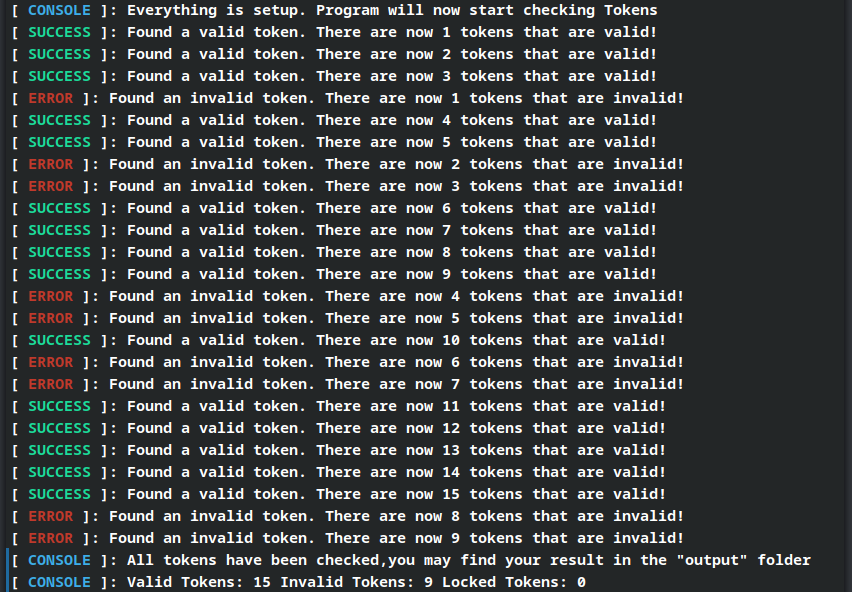

hi will republish this w/ good code later bye

# Discord Token Checker
Simple yet efficient tool used to check and sort tokens in terms of there validation.When the program is done,go to the "output" folder to see the results of 
what tokens are valid,invalid and locked.The code is pretty simple but it works.
If you'd like me to add another category for the checks then be sure to tell me.

# Installation

[1] Install  python 3.9 <a href="https://www.python.org/downloads/release/python-390/">here</a> (skip if you already have it installed) 

[2] Download this repo or install and use <a href="https://git-scm.com/book/en/v2/Getting-Started-Installing-Git">git</a> to download it

**Installation with GIT**
```
git clone https://github.com/Robotniks/Discord-Token-Checker
cd Discord-Token-Checker/
```

[3] Put your tokens in the **tokens.txt** file.
Example:

```
ODNKL44jM4YXDY0NjcwFTA6.L0zFn.o9xfgLqD3EdXfr5nMMuTPW0FScE
NjNKx0ksM4YXDRNjcwrA4.mNfn.cdf_8xdLqD3EdXfr4nxxgTFPrWaFdc
MjL0Lx0ksMxgjDfNjlwWr0.Nxz_d.Mgf_fo9xfgLqD3EdnxxgTQrDed10_
NzEzNTIwMDQ4NzQ0MTY5NDgz.XshVXA.begMepyxbMlCc4rBcGwsx_l5F4g
```

[4] Run the program

**Windows**
```
py main.py
```

**UNIX Based Systems**
```
python3.9 main.py
```

If you have any suggestions or problems be sure to open an issue 

# Program - Checking Preview




